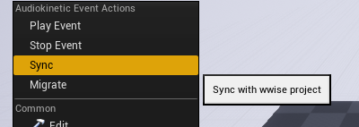

# WwiseSyncer

###  Modification On Wwise-Unreal 2019.2.3 Integration For Supporting To Use Auto Assets Sync On Old Version of Wwise

### Replace Wwise Folder With This Folder And Compile!

## * Open the auto sync swicth to enable function


## * ```Sync``` option is for banks' assignment & force sync all assets info(Only valid when auto sync asset settings is checked)



## * If you have some old assets, they might looks like no ID, use ```Migrate``` option to fill ID for all events & banks (Only valid when auto sync asset settings is unchecked)


### Testing Platform : Wwise 2018.1.9  UE 4.21.2 / UE 4.18
